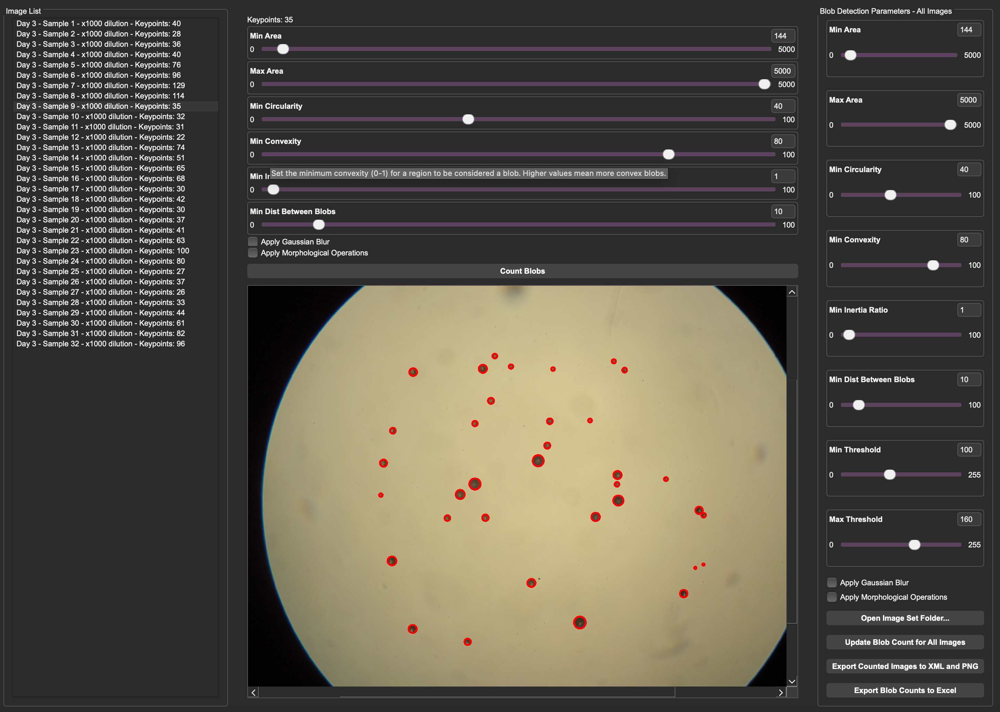

# Blob Counter

## About
BlobCounter is a GUI-based application that allows for parametrized automatic detection of blobs. 
It was originally developed to count colonies of yeast cells.

It is performance-optimized to allow for the handling of large images (up to 10000x10000 pixels)
and can be used for batch processing of images. 

It also provides a simple way to visualize the results of the blob detection process. 
Detected blobs are circled in red, and all images are pannable, zoomable, and savable.

Most significantly, BlobCounter allows for human intervention in the blob detection process.
The user can manually add or remove blobs from the detection results, and the application will update the results accordingly.
This allows for a more accurate detection process, especially in cases where the automatic detection process is not perfect.
As a result, this software works an excellent tool for generating training data for machine learning applications 
in addition to its primary purpose of blob detection for research pruposes.

## Features
- GUI-based application
- Parametrized automatic blob detection
- Batch processing of images
- Human intervention in the detection process
- Visualization of results
- Performance-optimized for large images
- Undo/Redo functionality
- Counted-image saving to PNG
- Counted blobs saved to XML
- Automatic, formatted output to XLSX

## Usage

